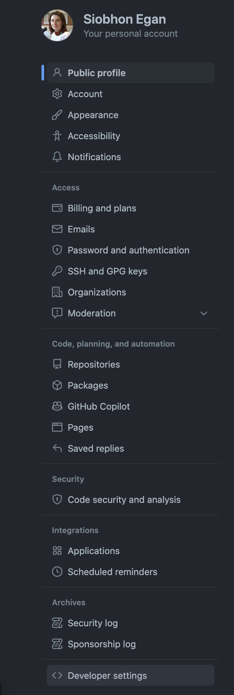

:::::::::::::::::::::::::::::::::::::: questions 

- How do I get set up to use Git?
- How do I establish authenticate my GitHub account?
- How do I get started on a new repository?

::::::::::::::::::::::::::::::::::::::::::::::::

::::::::::::::::::::::::::::::::::::: objectives

- Configure `git` the first time it is used on a computer.
- Understand the meaning of the `--global configuration` flag.
- Authentication of GitHub account (using PAT)
- Clone remote repository to local machine
- Push to or pull from a remote repository.

::::::::::::::::::::::::::::::::::::::::::::::::

## 1. GitHub signup

::::::::::::::::::::::::::::::::::::: checklist

If you have not already create a github account at https://github.com/signup

::::::::::::::::::::::::::::::::::::::::::::::::


## 2. Local configuration

:link: [Offical GitHub documentation](https://docs.github.com/en/get-started/getting-started-with-git/setting-your-username-in-git)

When we use Git on a new computer for the first time, we need to configure a few things. Below are a few examples of configurations we will set as we get started with Git:

- our name and email address,
- what our preferred text editor is,
- and that we want to use these settings globally (i.e. for every project).

On a command line, Git commands are written as `git verb options`, where `verb` is what we actually want to do and options is additional optional information which may be needed for the `verb.` So here is how Dracula sets up his new laptop:

Open a new terminal and configure your git workspace.

```bash
git config --global user.name "Firstname Surname"
git config --global user.email "yourname@email.com"
```

**check it worked**
```bash
git config --list
```


**Help!**

```bash
git help
```

:::::: callout

## One-off configuration

You only need to perform this step once per device.
::::::

## 3. Authentication via the command line

:link: [Offical GitHub documentation](https://docs.github.com/en/get-started/quickstart/set-up-git#authenticating-with-github-from-git)

You can access repositories on GitHub from the command line in two ways, HTTPS and SSH, and both have a different way of authenticating. The method of authenticating is determined based on whether you choose an HTTPS or SSH remote URL when you clone the repository. For more information about which way to access, see "About remote repositories."

 Connecting to a repository will look like either:

- A HTTPS URL like https://github.com/user/repo.git - 
You can work with all repositories on GitHub over HTTPS, even if you are behind a firewall or proxy.
- A SSH URL, like git@github.com:user/repo.git - You can work with all repositories on GitHub over SSH, although firewalls and proxies might refuse to allow SSH connections.

In this workshop we will use the **HTTPS** option and connect using a "personal access token (PAT)".

:::::::::::::::::::::::::::: callout

### Why HTTPS?

The "https://" clone URLs are available on all repositories, regardless of visibility. https:// clone URLs work even if you are behind a firewall or proxy.

::::::::::::::::::::::::::::::::::::::


Git associates a remote URL with a name, and your default remote is usually called `origin`.

To get this processing going quicker we will get started by creating our own repositories and cloning them to the local machine.

### Create Personal Access Token

:link: [Offical GitHub documentation](https://docs.github.com/en/authentication/keeping-your-account-and-data-secure/creating-a-personal-access-token)

Personal access tokens (PATs) are an alternative to using passwords for authentication to GitHub when using the GitHub API or the command line.

1. Verify your email address, if it hasn't been verified yet.
2. In the upper-right corner of any page, click your profile photo, then click Settings.
  - { width=50% }
3. In the left sidebar, click  Developer settings.
  - { width=50% }
4. In the left sidebar, click Personal access tokens.
  -  { width=75% }
5. Click Generate new token.
6. Give your token a descriptive name.
7. To give your token an expiration, select the Expiration drop-down menu, then click a default or use the calendar picker.
  - 
  - 
8. Select the scopes, or permissions, you'd like to grant this token. To use your token to access repositories from the command line, select repo. 

- *Suggested options for selection*:

  - :white_check_mark: **repo**
  - :white_check_mark: **workflow**
  - :white_check_mark: **admin:repo_hook**
  - :white_check_mark: **gists**
  - :white_check_mark: **notifications**
  - :white_check_mark: **user**
  - :white_check_mark: **project**

9. Click Generate token.
  - 
  

:::::::::::::: callout

### Warning

*Immediately copy and paste this token into a text document so we can use it in the next step.*
Treat your tokens like passwords and keep them secret. When working with the API, use tokens as environment variables instead of hardcoding them into your programs.
:::::::::::::: 


Once you have a token, you can enter it instead of your password when performing Git operations over HTTPS.

We will use it in the next step when we get up our first repository.

An example on the command line - you would enter the following:

```bash
$ git clone https://github.com/username/repo.git
Username: your_username
Password: your_token
```

:::::::::::::: callout

### Using a token on the command line

If you are not prompted for your username and password, your credentials may be cached on your computer. You can update your credentials in the Keychain to replace your old password with the token.

Instead of manually entering your PAT for every HTTPS Git operation, you can cache your PAT with a Git client. Git will temporarily store your credentials in memory until an expiry interval has passed. You can also store the token in a plain text file that Git can read before every request. For more information, see "Caching your GitHub credentials in Git."

:::::::::::::: 


## 4. Your first repository

### Create an online repo

- Go the the [GitHub](https://github.com/) and make sure you are logged in.
- Navigate to top right hand corner and select **+** > **New Repository**
  - 
- Let's create a repository called `planets`, and select option for public and select :white_check_mark: Add a README file and then **Create Repository**.
  - 

### Clone the repository

We will now clone this repository to our local machine
using HTTPS.

You can find the URL link by clicking on the green **Code** button and under the **HTTPS** tab copy the link.


Now open **Terminal** (macOS) *or* **Git Bash** (windows) and enter the following

```bash
cd ~/Desktop
git clone https://github.com/username/planets.git
Username: your_username
Password: your_token
```

:::::: callout

## On-going Authentication

You won't have to enter your username and password until your PAT expires. For updating your PAT check out tutorials for [macOS keychain](https://docs.github.com/en/get-started/getting-started-with-git/updating-credentials-from-the-macos-keychain). Alternatively you can use [GitHub CLI or Git Credential Manager (GCM) to remember your credentials](https://docs.github.com/en/get-started/getting-started-with-git/caching-your-github-credentials-in-git).
::::::

---


:::::: keypoints
 - Use `git config` with the `--global` option to configure a user name, email address, editor, and other preferences once per machine.
 - Get help with `git help`
 - Authentication to GitHub via the command line can be via HTTPS and SSH - here we used Personal Access Token (PAT)
 - Clone repository with `git clone`
::::::
