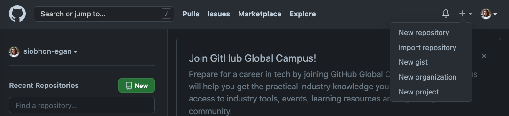
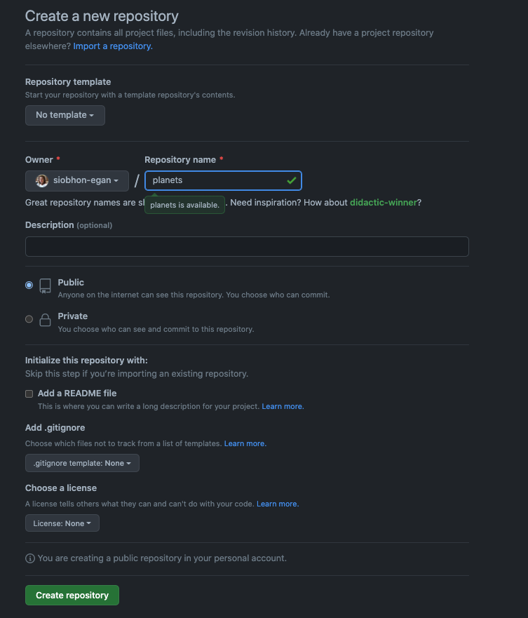
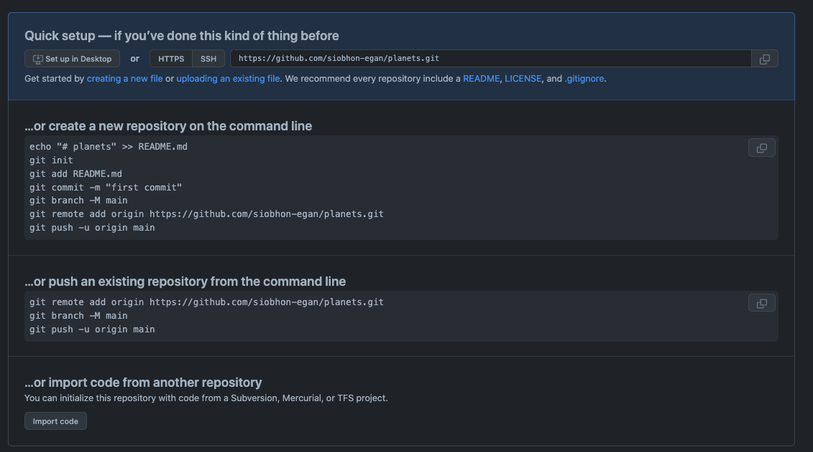
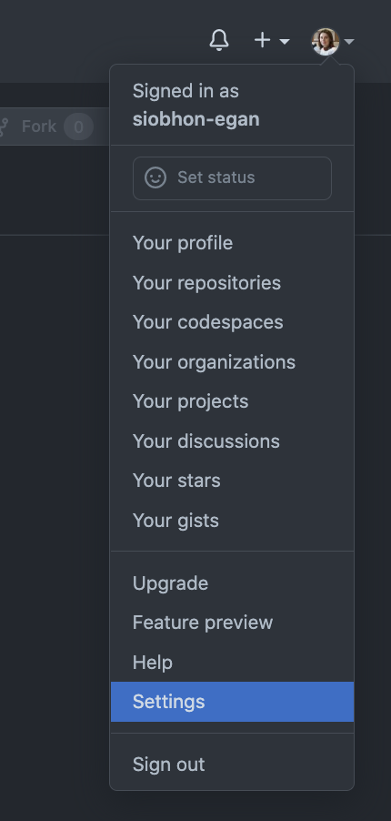

:::::::::::::::::::::::::::::::::::::: questions 

- How do I share my changes with others on the web?

::::::::::::::::::::::::::::::::::::::::::::::::

::::::::::::::::::::::::::::::::::::: objectives

- Explain what remote repositories are and why they are useful.
- Push to or pull from a remote repository.

::::::::::::::::::::::::::::::::::::::::::::::::


Version control really comes into its own when we begin to collaborate with
other people.  We already have most of the machinery we need to do this; the
only thing missing is to copy changes from one repository to another.

Systems like Git allow us to move work between any two repositories.  In
practice, though, it's easiest to use one copy as a central hub, and to keep it
on the web rather than on someone's laptop.  Most programmers use hosting
services like [GitHub](https://github.com), [Bitbucket](https://bitbucket.org) or
[GitLab](https://gitlab.com/) to hold those main copies; we'll explore the pros
and cons of this in a later episode.

Let's start by sharing the changes we've made to our current project with the
world. To this end we are going to create a *remote* repository that will be linked to our *local* repository.


## 1. Create a remote repository

Log in to [GitHub](https://github.com), then click on the icon in the top right corner to
create a new repository called `planets`:



Name your repository "planets" and then click "Create Repository".

**Note**: Since this repository will be connected to a local repository, it needs to be empty. Leave "Initialize this repository with a README" **unchecked**, and keep "None" as options for both "Add .gitignore" and "Add a license." See the "GitHub License and README files" exercise below for a full explanation of why the repository needs to be empty.

{width=75%}

As soon as the repository is created, GitHub displays a page with a URL and some
information on how to configure your local repository:



This effectively does the following on GitHub's servers:

```bash
mkdir planets
cd planets
git init
```

If you remember back to the earlier [episode](04-changes.html) where we added and
committed our earlier work on `mars.txt`, we had a diagram of the local repository
which looked like this:


Now that we have two repositories, we need a diagram like this:


Note that our local repository still contains our earlier work on `mars.txt`, but the
remote repository on GitHub appears empty as it doesn't contain any files yet.

## 2. Create a personal access token

:link: [Offical GitHub documentation](https://docs.github.com/en/get-started/quickstart/set-up-git#authenticating-with-github-from-git)

You can access repositories on GitHub from the command line in two ways, HTTPS and SSH, and both have a different way of authenticating. The method of authenticating is determined based on whether you choose an HTTPS or SSH remote URL when you clone the repository. For more information about which way to access, see "About remote repositories."

Connecting to a repository will look like either:

- A HTTPS URL like https://github.com/user/repo.git -
You can work with all repositories on GitHub over HTTPS, even if you are behind a firewall or proxy.
- A SSH URL, like git@github.com:user/repo.git - You can work with all repositories on GitHub over SSH, although firewalls and proxies might refuse to allow SSH connections.

In this workshop we will use the **HTTPS** option and connect using a "personal access token (PAT)".

:::::::::::::::::::::::::::: callout

### Why HTTPS?

The `https://` clone URLs are available on all repositories, regardless of visibility. `https://` clone URLs work even if you are behind a firewall or proxy.

::::::::::::::::::::::::::::::::::::::

Git associates a remote URL with a name, and your default remote is usually called `origin`.

When you `git clone`, `git fetch`, `git pull`, or `git push` to a remote repository using HTTPS URLs on the command line, Git will ask for your GitHub username and password. When Git prompts you for your password, enter your personal access token (PAT). Alternatively, you can use a credential helper like [Git Credential Manager](https://github.com/GitCredentialManager/git-credential-manager/blob/main/README.md). Password-based authentication for Git has been removed in favor of more secure authentication methods. For more information, see "[Creating a personal access token](https://docs.github.com/en/github/authenticating-to-github/creating-a-personal-access-token)."

If you are accessing an organization that uses SAML SSO, you must also authorize your personal access token to access the organization before you authenticate. For more information, see "[About authentication with SAML single sign-on](https://docs.github.com/en/github/authenticating-to-github/about-authentication-with-saml-single-sign-on)" and "[Authorizing a personal access token for use with SAML single sign-on](https://docs.github.com/en/github/authenticating-to-github/authorizing-a-personal-access-token-for-use-with-saml-single-sign-on)."

To get this processing going quicker we will get started by creating our own repositories and cloning them to the local machine.

### Create Personal Access Token

:link: [Offical GitHub documentation](https://docs.github.com/en/authentication/keeping-your-account-and-data-secure/creating-a-personal-access-token)

Personal access tokens (PATs) are an alternative to using passwords for authentication to GitHub when using the GitHub API or the command line.

1. Verify your email address, if it hasn't been verified yet.
2. In the upper-right corner of any page, click your profile photo, then click Settings.
  - {width=30%}
3. In the left sidebar, click  Developer settings.
  - { width=40% }
4. In the left sidebar, click Personal access tokens.
  - { width=40% }
5. Click Generate new token.
6. Give your token a descriptive name.
7. To give your token an expiration, select the Expiration drop-down menu, then click a default or use the calendar picker.
  - 
  - 
8. Select the scopes, or permissions, you'd like to grant this token. To use your token to access repositories from the command line, select repo.

- *Suggested options for selection*:

  - :white_check_mark: **repo**
  - :white_check_mark: **workflow**
  - :white_check_mark: **admin:repo_hook**
  - :white_check_mark: **gists**
  - :white_check_mark: **notifications**
  - :white_check_mark: **user**
  - :white_check_mark: **project**

9. Click Generate token.
  - 


:::::::::::::: callout

### Warning

*Immediately copy and paste this token into a text document so we can use it in the next step.*
Treat your tokens like passwords and keep them secret. When working with the API, use tokens as environment variables instead of hardcoding them into your programs.

::::::::::::::

Once you have a token, you can enter it instead of your password when performing Git operations over HTTPS.

## 3. Connect local to remote repository

Now we connect the two repositories.  
We do this by making the GitHub repository a remote for the local repository.
The home page of the repository on GitHub includes the URL string we need to identify it:


> Make sure you copy the HTTPS URL for cloining

Copy that URL from the browser, go into the local `planets` repository, and run
this command:

```bash
git remote add origin https://github.com/siobhon-egan/planets.git
```

Make sure to use the URL for your repository rather than Vlad's: the only
difference should be your username instead of `vlad`.

`origin` is a local name used to refer to the remote repository. It could be called
anything, but `origin` is a convention that is often used by default in git
and GitHub, so it's helpful to stick with this unless there's a reason not to.

We can check that the command has worked by running `git remote -v`:

```bash
git remote -v
```

```output
origin   https://github.com/vlad/planets.git (fetch)
origin   https://github.com/vlad/planets.git (push)
```

:::::::::::::: callout

### Using a token on the command line

If you are not prompted for your username and password, your credentials may be cached on your computer. You can update your credentials in the Keychain to replace your old password with the token.

Instead of manually entering your PAT for every HTTPS Git operation, you can cache your PAT with a Git client. Git will temporarily store your credentials in memory until an expiry interval has passed. You can also store the token in a plain text file that Git can read before every request. For more information, see "[Caching your GitHub credentials in Git](https://docs.github.com/en/get-started/getting-started-with-git/caching-your-github-credentials-in-git)."

::::::::::::::

## 4. Push local changes to a remote

Now that authentication is setup, we can return to the remote.  This command will push the changes from our local repository to the repository on GitHub:

```bash
git push origin main
```

```output
Enumerating objects: 16, done.
Counting objects: 100% (16/16), done.
Delta compression using up to 8 threads.
Compressing objects: 100% (11/11), done.
Writing objects: 100% (16/16), 1.45 KiB | 372.00 KiB/s, done.
Total 16 (delta 2), reused 0 (delta 0)
remote: Resolving deltas: 100% (2/2), done.
To https://github.com/vlad/planets.git
 * [new branch]      main -> main
```


:::::::::::::: discussion

### Branch error

If you get the following error it means your branch was not correctly set the branch to `main` during the [third lesson](03-create.html). 

```error
error: src refspec main does not match any
error: failed to push some refs to 'https://github.com/vlad/planets.git'
```
:::::::::::::: 

::::::::::::::  solution

To fix this first we need to change to the main branch this you will will need to change

```bash
git checkout -b main
```

```output
Switched to a new branch 'main'
```

Then try to push again and it should work
```bash
git push origin main
```

:::::::::::::: 

Our local and remote repositories are now in this state:


:::::: callout

## The '-u' Flag

You may see a `-u` option used with `git push` in some documentation.  This
option is synonymous with the `--set-upstream-to` option for the `git branch`
command, and is used to associate the current branch with a remote branch so
that the `git pull` command can be used without any arguments. To do this,
simply use `git push -u origin main` once the remote has been set up.

::::::

We can pull changes from the remote repository to the local one as well:

```bash
git pull origin main
```

```output
From https://github.com/vlad/planets
 * branch            main     -> FETCH_HEAD
Already up-to-date.
```

Pulling has no effect in this case because the two repositories are already
synchronized.  If someone else had pushed some changes to the repository on
GitHub, though, this command would download them to our local repository.


:::::: discussion

## GitHub GUI

Browse to your `planets` repository on GitHub.
Under the Code tab, find and click on the text that says "XX commits" (where "XX" is some number).
Hover over, and click on, the three buttons to the right of each commit.
What information can you gather/explore from these buttons?
How would you get that same information in the shell?

:::::: 

:::::: solution

The left-most button (with the picture of a clipboard) copies the full identifier of the commit 
to the clipboard. In the shell, ```git log``` will show you the full commit identifier for each 
commit.

When you click on the middle button, you'll see all of the changes that were made in that 
particular commit. Green shaded lines indicate additions and red ones removals. In the shell we 
can do the same thing with ```git diff```. In particular, ```git diff ID1..ID2``` where ID1 and 
ID2 are commit identifiers (e.g. ```git diff a3bf1e5..041e637```) will show the differences 
between those two commits.

The right-most button lets you view all of the files in the repository at the time of that 
commit. To do this in the shell, we'd need to checkout the repository at that particular time. 
We can do this with ```git checkout ID``` where ID is the identifier of the commit we want to 
look at. If we do this, we need to remember to put the repository back to the right state 
afterwards!

::::::

:::::: callout

## Uploading files directly in GitHub browser

Github also allows you to skip the command line and upload files directly to 
your repository without having to leave the browser. There are two options. 
First you can click the "Upload files" button in the toolbar at the top of the
file tree. Or, you can drag and drop files from your desktop onto the file 
tree. You can read more about this [on this GitHub page](https://help.github.com/articles/adding-a-file-to-a-repository/)

:::::: 

:::::: discussion

## GitHub Timestamp

Create a remote repository on GitHub. Push the contents of your local
repository to the remote. Make changes to your local repository and push these
changes. Go to the repo you just created on GitHub and check the
[timestamps](../learners.reference.md) of the files. How does GitHub
record times, and why?

:::::: 

:::::: solution

GitHub displays timestamps in a human readable relative format (i.e. "22 hours ago" or "three 
weeks ago"). However, if you hover over the timestamp, you can see the exact time at which the 
last change to the file occurred.

::::::


:::::: discussion

## Push vs. Commit

In this episode, we introduced the "git push" command.
How is "git push" different from "git commit"?

::::::

:::::: solution

When we push changes, we're interacting with a remote repository to update it with the changes 
we've made locally (often this corresponds to sharing the changes we've made with others). 
Commit only updates your local repository.

::::::


:::::: discussion

## GitHub License and README files

In this episode we learned about creating a remote repository on GitHub, but when you initialized your GitHub repo, you didn't add a README.md or a license file. If you had, what do you think would have happened when you tried to link your local and remote repositories?

::::::

:::::: solution

In this case, we'd see a merge conflict due to unrelated histories. When GitHub creates a README.md file, it performs a commit in the remote repository. When you try to pull the remote repository to your local repository, Git detects that they have histories that do not share a common origin and refuses to merge.

```bash
git pull origin main
```

```output
warning: no common commits
remote: Enumerating objects: 3, done.
remote: Counting objects: 100% (3/3), done.
remote: Total 3 (delta 0), reused 0 (delta 0), pack-reused 0
Unpacking objects: 100% (3/3), done.
From https://github.com/vlad/planets
 * branch            main     -> FETCH_HEAD
 * [new branch]      main     -> origin/main
fatal: refusing to merge unrelated histories
```


You can force git to merge the two repositories with the option `--allow-unrelated-histories`. 
Be careful when you use this option and carefully examine the contents of local and remote repositories before merging.
```bash
git pull --allow-unrelated-histories origin main
```

```output
From https://github.com/vlad/planets
 * branch            main     -> FETCH_HEAD
Merge made by the 'recursive' strategy.
README.md | 1 +
1 file changed, 1 insertion(+)
create mode 100644 README.md
```

::::::

:::::: callout

## On-going Authentication

You won't have to enter your username and password until your PAT expires. For updating your PAT check out tutorials for [macOS keychain](https://docs.github.com/en/get-started/getting-started-with-git/updating-credentials-from-the-macos-keychain). Alternatively you can use [GitHub CLI or Git Credential Manager (GCM) to remember your credentials](https://docs.github.com/en/get-started/getting-started-with-git/caching-your-github-credentials-in-git).

::::::


---


:::::: keypoints
 - A local Git repository can be connected to one or more remote repositories.
 - Authentication to GitHub via the command line can be via HTTPS and SSH - here we used Personal Access Token (PAT)
 - `git push` copies changes from a local repository to a remote repository.
 - `git pull` copies changes from a remote repository to a local repository.
::::::
