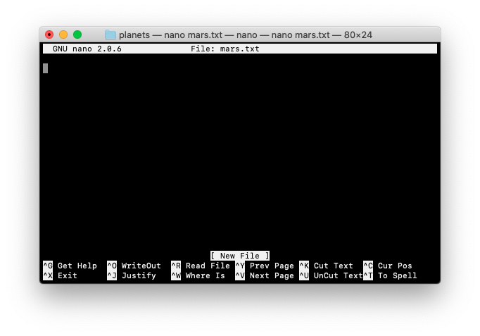
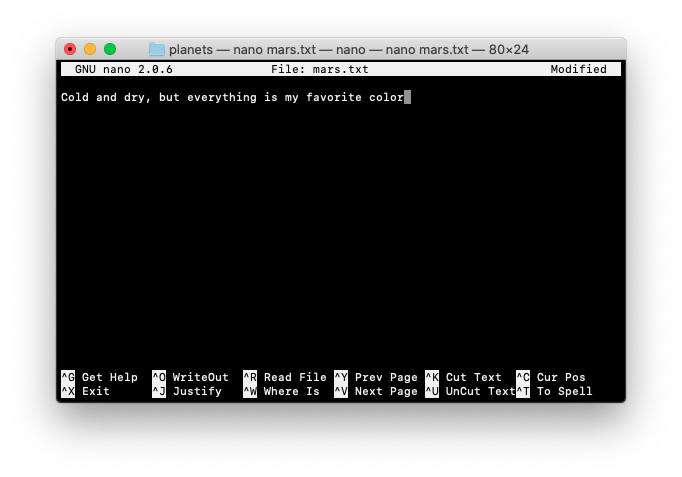

:::::::::::::::::::::::::::::::::::::: questions 

- How do I record changes in Git?
- How do I check the status of my version control repository?
- How do I record notes about what changes I made and why?

::::::::::::::::::::::::::::::::::::::::::::::::

::::::::::::::::::::::::::::::::::::: objectives

- Go through the modify-add-commit cycle for one or more files.
- Explain where information is stored at each stage of that cycle.
- Distinguish between descriptive and non-descriptive commit messages.

::::::::::::::::::::::::::::::::::::::::::::::::


## Check out our local repo

In this next part we will make some changes in the planets repo that we cloned earlier.

```bash
cd ~/Desktop/planets
```

If we use ls to show the directory’s contents, it appears that nothing has changed:

```bash
ls
```

But if we add the -a flag to show everything, we can see that Git has created a hidden directory within planets called .git:
```bash
ls -a
```

```output
.	..	.git
```

Git uses this special subdirectory to store all the information about the project, including the tracked files and sub-directories located within the project’s directory. If we ever delete the `.git` subdirectory, we will lose the project’s history.

Next, we will change the default branch to be called `main.` This might be the default branch depending on your settings and version of git. See the setup episode for more information on this change.

```bash
git checkout -b main
```

Switched to a new branch 'main'
We can check that everything is set up correctly by asking Git to tell us the status of our project:

```bash
git status
```

```output
On branch main
Your branch is up to date with 'origin/main'.

nothing to commit, working tree clean
```

If you are using a different version of git, the exact wording of the output might be slightly different.


## Make some changes

### Make new text file

```bash
touch mars.txt
```

Now let's check what in the folder

```bash
ls
```

```output
README.md
mars.txt
````

We can edit our `mars.txt` file. You can open it in any text editor you like e.g. TextEdit (macOS) or notepad (windows).

Alternatively we can use in built nano text editor

```
nano mars.txt
```



Start typing to add in new text.



To exit the editor on macOS press <kbd>Control</kbd> + <kbd>X</kbd>, it will prompt you to save changes press <kbd>Y</kbd> and <kbd>Return</kbd>.


We can see our new text in the `mars.txt` file

```bash
cat mars.txt
```

```output
a new line of text
```

### Check status

Now lets check the git status

```bash
git status
```

```output
On branch main
Your branch is up to date with 'origin/main'.

Untracked files:
  (use "git add <file>..." to include in what will be committed)
	mars.txt

nothing added to commit but untracked files present (use "git add" to track)
```

The "untracked files" message means that there’s a file in the directory that Git isn’t keeping track of. We can tell Git to track a file using git add:

### git add


```bash
git add mars.txt 
```


```bash
git status
```

```output
On branch main
Your branch is up to date with 'origin/main'.

Changes to be committed:
  (use "git restore --staged <file>..." to unstage)
	new file:   mars.txt
```

### git commit

```bash
git commit -m "adding mars file"
```

```output
[main 990234f] adding mars file
 1 file changed, 1 insertion(+)
 create mode 100644 mars.txt
```

When we run git commit, Git takes everything we have told it to save by using git add and stores a copy permanently inside the special .git directory. This permanent copy is called a commit (or revision) and its short identifier is f22b25e. Your commit may have another identifier.

We use the -m flag (for "message") to record a short, descriptive, and specific comment that will help us remember later on what we did and why. If we just run git commit without the -m option, Git will launch nano (or whatever other editor we configured as core.editor) so that we can write a longer message.

**Good commit messages** start with a brief (<50 characters) statement about the changes made in the commit. Generally, the message should complete the sentence "If applied, this commit will". If you want to go into more detail, add a blank line between the summary line and your additional notes. Use this additional space to explain why you made changes and/or what their impact will be.

### git push

```bash
git push
```

```output
Enumerating objects: 4, done.
Counting objects: 100% (4/4), done.
Delta compression using up to 8 threads
Compressing objects: 100% (2/2), done.
Writing objects: 100% (3/3), 307 bytes | 307.00 KiB/s, done.
Total 3 (delta 0), reused 0 (delta 0)
To https://github.com/siobhon-egan/planets.git
   64793a2..990234f  main -> main
```

```bash
git status
```

```output
On branch main
Your branch is up to date with 'origin/main'.

nothing to commit, working tree clean
```

We can check logs

```
git log
```

```output
commit 990234f2a0dbc4ba2d65fda69ec46d73440d29c7 (HEAD -> main, origin/main, origin/HEAD)
Author: Siobhon Egan <Siobhon.Egan@murdoch.edu.au>
Date:   Thu Aug 25 21:58:42 2022 +0800

    adding mars file

commit 64793a22b21bd9aec11e0e5e23892126cf5372f0
Author: Siobhon Egan <Siobhon.Egan@murdoch.edu.au>
Date:   Thu Aug 25 19:57:03 2022 +0800

    Initial commit
(END)
```

Press <kbd>q</kbd> to exit

git log lists all commits made to a repository in reverse chronological order. The listing for each commit includes the commit’s full identifier (which starts with the same characters as the short identifier printed by the git commit command earlier), the commit’s author, when it was created, and the log message Git was given when the commit was created.

### Check changes online


Now let's checkout the repo online and see if the changes are there!


If we click on **commits** under the green code button we can find history of the commits


Additions are highlighed in green and deletions in red


---

:::::: callout

### git init

Because we cloned this repo from our GitHub we didn't need to initialize a git repo. You if you want to create a local repository first (and then push to github) you will need to `git init`

It is important to note that git init will create a repository that can include subdirectories and their files—there is no need to create separate repositories nested within the planets repository, whether subdirectories are present from the beginning or added later. Also, note that the creation of the planets directory and its initialization as a repository are completely separate processes.
::::::

---


:::::: keypoints
 - `git status` is your go-to check of the git repo
 - `git add`
 - `git commit -m "message`
 - `git push`
::::::
