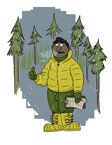
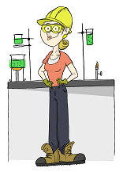
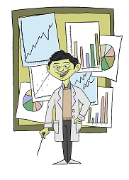

Our workshop attendees include postgraduate students, early career researchers, postdocs, undergraduates, academic and non-academic staff, including those working in government or industry, and people working in library- and information-related roles. The learner profiles below provide examples of the diverse domain backgrounds, levels of computational experience, and career stages of our learners. Information below is taken from [audience examples](https://carpentries.org/audience/) provided by the [carpentries](https://carpentries.org/).

## Mehrdad Mapping

Mehrdad Mapping is a graduate student studying bark beetle infestations in the Canadian taiga. He has never taken a programming course, but used SAS in an undergraduate statistics course.

For the last three years, Mehrdad has spent six weeks every autumn counting beetle bores in pine trees in the Yukon and Alaska. He now has a spreadsheet with 5,000 entries, each recording the location and time of a measurement, the number of bores found, the moisture and acidity of the soil, and several other values. He also has two hundred text files containing 7,000 measurements that his supervisor made in the same regions in the 1970s and 1980s. His task now is to clean up and analyse both sets of measurements so that he can start to correlate changes in bark beetle distribution with changes in climate.

In high school, Mehrdad was diagnosed with Attention Deficit Disorder, which he learned to manage.

Software Carpentry will teach Mehrdad how to standardise, merge, and set up basic analyses for these data sets, and how to produce the figures and tables he needs for his papers with just a few lines of code. In addition, it will show him how to use web services to generate and share maps of these data with colleagues.

## Helen Helmet

Helen Helmet, a Ph.D. student in mechanical engineering, is currently doing a six-month internship at an engineering firm that makes carbon-fiber helmets for firefighters and other emergency service personnel. Her undergraduate courses included an introduction to scientific computing using MATLAB and a robotics course that used C. She learned some Python during a co-op placement between her junior and senior years, and used it again in a graduate course on finite elements.

Helen's task is to model the non-combustive thermal degradation (otherwise known as "melting") of candidate materials. Her starting point is a 4,000-line Python program that her supervisor wrote six years ago. She is currently trying to replace the mesh deformation functions with new ones that can handle non-uniform meshes. She sometimes writes, runs, and deletes sections of code three or four times before she is satisfied.

Helen tests her program by writing the total heat content of the mesh at each time step to a file. She then loads this data into a separate Python program to graph the percentage differences between these values and the ones produced by the original program for six sample problems. Right now, the difference is less than 5% for five test cases, but 30% for the sixth. Helen has added hundreds of `print` statements to the program to try to track down the bug, but still doesn't know where it is.

Helen has been diagnosed with coeliac disease.

Software Carpentry will teach Helen to develop and modify programs in a disciplined way, to debug programs systematically, and to use tests to ensure that new code doesn't break old code.

## Fan Fullerene

Fan Fullerene is a graduate student in chemistry who is working as a lab technician to help cover his family's living costs. His only programming experience is a general first-year introduction to computational science using Python.

Fan's supervisor is studying the production of fullerenes (also known as "buckyballs"). Each set of experiments involves testing a sample at 20 different temperatures and 15 different pressures. Using a machine borrowed from a collaborating lab, Fan can run all temperature and pressure combinations in one job, but must upload a parameter file to the machine to do this. The temperatures and pressures to be used vary from sample to sample, so Fan now has two dozen different parameter files, each containing 300 lines of control information that he fervently hopes is correct.

The machine sends these files to Fan once the experiment is completed. Fan analyses them by opening Excel, copying and pasting the data into a spreadsheet, then creating a chart using the chart wizard. He then saves the chart as a PNG file on the group's web site, along with the original data file.

Fan and his wife have had two children arrive while in graduate school, and his research progress is behind that of his peers. He is very nervous about finishing his PhD and suffers from undiagnosed depression.

Software Carpentry will teach Fan how to write programs to generate parameter files and analyse experimental results, and how to track the provenance of the data he is working with so that scientists can trace backward from the final charts to the raw data they represent. It will also teach him how to use version control systems to manage changes to his code.
